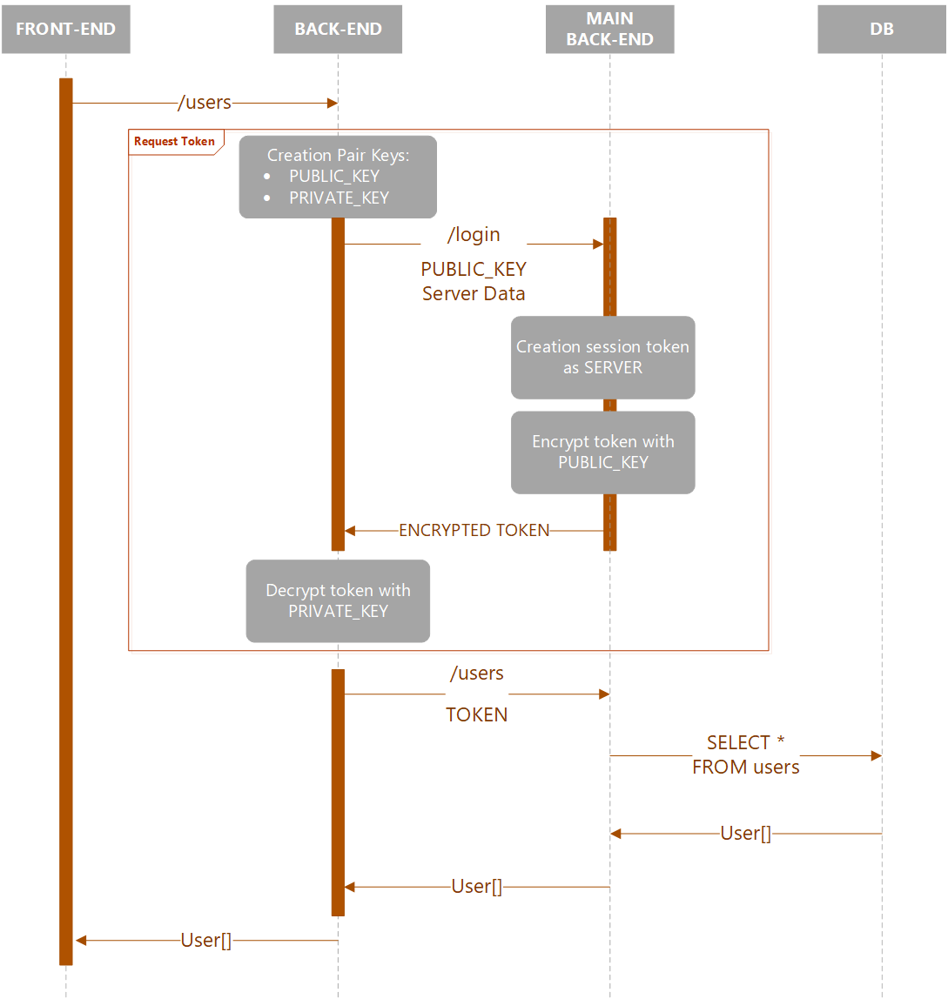

# runtheons-intranet

- [Introduction](https://github.com/Zexal0807/runtheons-intranet#introduction)
- [Intranet working](https://github.com/Zexal0807/runtheons-intranet#intranet-working)
  - [How work](https://github.com/Zexal0807/runtheons-intranet#how-work)
- [Getting started](https://github.com/Zexal0807/runtheons-intranet#getting-started)
  - [Prerequisites](https://github.com/Zexal0807/runtheons-intranet#prerequisites)
  - [Installation](https://github.com/Zexal0807/runtheons-intranet#installation)
- [Use](https://github.com/Zexal0807/runtheons-intranet#use)

# Introduction

This reposity manage the intranet call of Runtheons BackEnd

If the aforementioned documentation is not clear or contains errors, please report it immediately to the email address **bugs-documentation@runtheons.com** or report the issue here on GitHub. Please be extremely clear and precise in the description of the issue so that moderators can correct it as soon as possible.

# Intanet working

We created intranet for allow the database access only from the main backend, we allow the access from all sub backend using the intranet

## How work

When the sub backend receive an http request that must access to db, he must connect with an intranet request to the main backend, for do that; it generate a pair keys (public and private), make a HTTP request to main backend sending the public key, thi request must login as a server, the generated session token will encreeypt using the puclic key passed before sending back; when receive the encrypted token the sub backend decrypt it using the private key, then make a HTTP request to the main backend

Here an image for example



# Getting started

## Prerequisites

1. Git
2. Node: any 14.x version starting with v14.5.0 or greater

## Installation

1. `npm install https://github.com/Zexal0807/runtheons-intranet` to add the package to the project

# Use

In main backend must create a login route

```javascript
const IntranetManager = require('@runtheons/intranet');

var payload = {
	server: serverData
};

var token = generateToken(payload);

var encryptedToken = IntranetManager.cryptPayload(token, req.publicKey);

return encryptedToken;
```

Then in your sub backend, require the token

```javascript
const IntranetManager = require('@runtheons/intranet');

const serverData = 'MySubBackend';

var token = await IntranetManager.requestToken(serverData, {
	host: 'https://main.backend.com',
	url: '/login',
	method: 'POST'
});

return { token: token };
```

Then in your sub backend make the request

```javascript
const axios = require('axios');

const response = await axios({
	method: 'GET',
	url: '/users',
	headers: {
		Authorization: 'Bearer ' + token
	}
});
```
